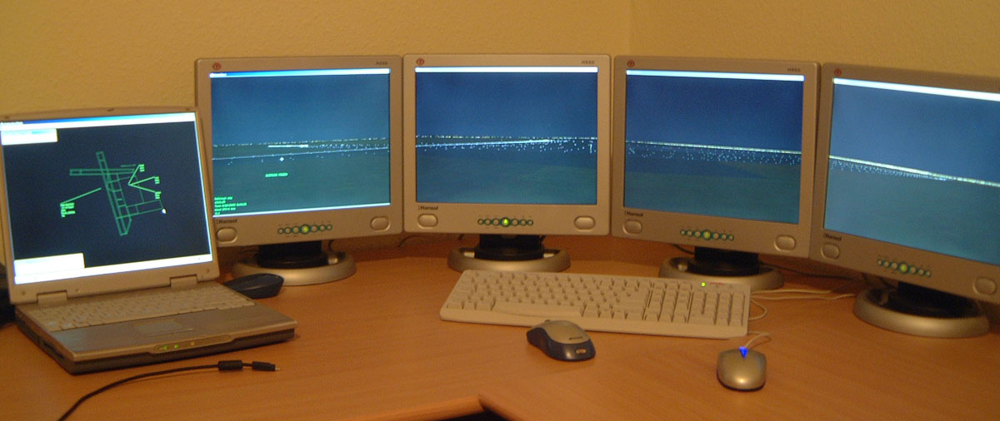
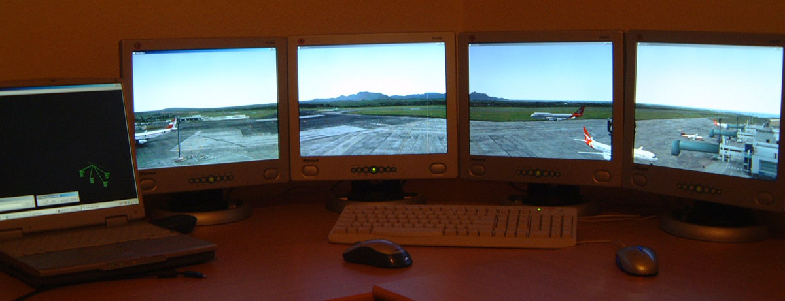
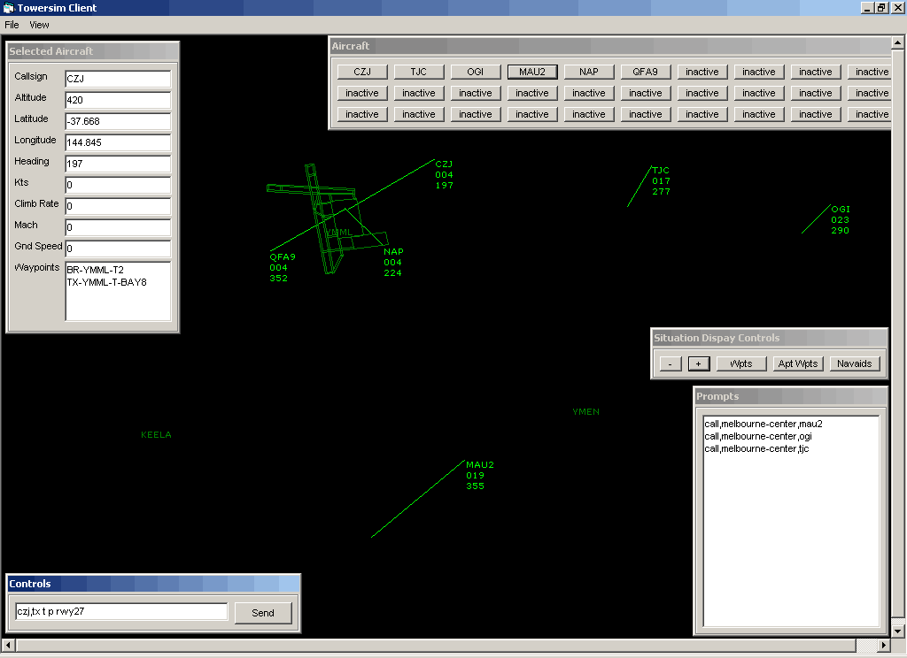

# Towersim ATC Tower Simulator

TowerSim is a 360 degree air traffic control tower simulator designed to be used in the training of aerodrome controllers. 

TowerSim can be set up to simulate any airport provided the geographical co-ordinates of the runways, taxiways, parking bays and navaids for the area are supplied. 

Configuring airports is a relatively easy process, with a very basic version of FIMP being completed in a week. Once the configuration files, that describe the airport's GPS locations and the photos, are processed, the aircraft can accept commands and be directed around the environment. 

Aircraft data and appearance is easily editable so creating aircraft that resemble the local traffic is possible. 

TowerSim is server/client based so it can be setup to run on 1 pc or shared across several. The traffic generator and graphics generators are separated so one traffic generator can provide data to up to 8 other graphic generators which can then display up to 8 separate displays. A possible setup would be one traffic generator driving two graphics generators with 4 displays each. This would give 360 degrees of view. Each graphics generator can display a different geographical location also, so if you wanted you could simulate adjacent airports and be running the same exercise for added realism. However the example shown on the photos below uses one pc to run the traffic and graphics generator together. 

Aircraft are controlled by the TGO pilot positions. 

TowerSim has many configuration files written in in text format, which are easily edited using any text editor. 

Some of the editable portions of the simulator are, 

* Aircraft performance data and graphics
* Runways
* Taxiways
* Navaids (ILS, VOR, NDB, DME)
* Exercises
* Standard Flight Plans
* Aircraft start times and prompts
* Airport objects such as lights, vehicles, parking bays, or any other 3D object that needs to be added.
* Weather, such as visibility, rain and clouds.
* User defined buttons and macros for the TGO management console.
* Voice switching channels, (Frequencies, Hotlines and Coldlines)

An aircraft's simulation can be either totally controlled by artificial intelligence or from the pilot positions via requests by a trainee controller. A typical example of AI control might be when a aircraft needs to control itself while in somebody else's airspace, i.e. an aircraft departs from another airport and flies via several waypoints and navaids until it gets to the towers airspace, where it will contact the tower to receive a landing clearance, taxi instructions, touch and go, or anything else. There are many commands that the aircraft can accept, either by SFP (Standard Flight Plan) or manual entry that will enable the aircraft to do whatever is desired. All of this is entered into the text based configuration files or via the Pilot Positions. 

The Pilot positions consist of a management console, which enables sending commands to each aircraft, general simulator settings and a situation display that displays each aircrafts location, level, heading, navaids and airport. There are several programmable macro buttons for common commands. For example, an instruction to taxi via S E P taxiways for RWY 27 at Melbourne, a clearance to land, take off and proceed via a standard instrument departure, or many other options. 

TowerSim uses standard of the shelf PC hardware so it is modern, widely available, cheap and easily upgradeable. 

There are no geographical limitations of the simulator, so any airport can be simulated, whether northern hemisphere, southern hemisphere, 2000 feet high, surrounded by mountains, in the middle of the ocean, or whatever your needs. Planned development of runways and airports could also be simulated. 

## Videos of TowerSim

### [Formation Flying](https://www.youtube.com/watch?v=6VXA1v43T2Q)

### [360 Degree View](https://www.youtube.com/watch?v=hm7wlnK0wfc)

### [737 Landing](https://www.youtube.com/watch?v=JFNRRpT7xk0)

### [Rain and Visibiltiy](https://www.youtube.com/watch?v=D5JUErlso4o)

### [Multi Display](https://www.youtube.com/watch?v=s6uBFv1X1zk)

### [Night Simulation](https://www.youtube.com/watch?v=z79pnR52NGI)

### [Other Things in TowerSim](https://www.youtube.com/watch?v=t9rv5JNxadc)

## Images of TowerSim

